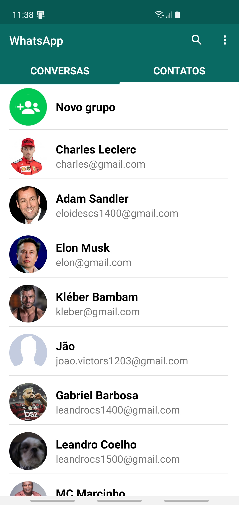

## Repositório para desenvolvimento android usando o AndroidStudio
* **Verifique as branches para acessar todos os projetos**
* **Organizado da seguinte maneira:**
    * > Projeto classificados com números na frente - Os projetos que são um app completo em si mesmos, com começo, meio e fim.
    * > Projetos classificados com X na frente - Os projetos que são experimentais para abordar uma tarefa específica afim de aprendizado.

    ### [14 - WhatsApp Clone 📞](https://github.com/Williamcs1400/Android/tree/14-WhatsApp)
    